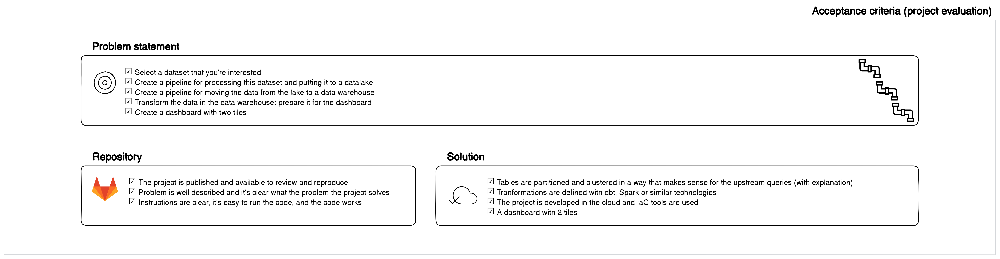
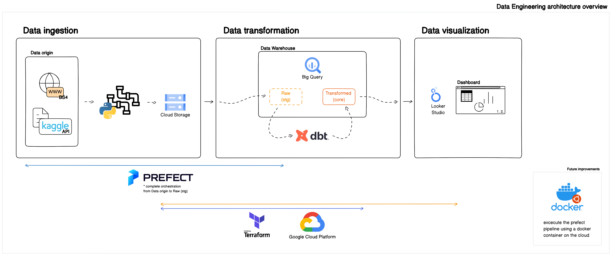
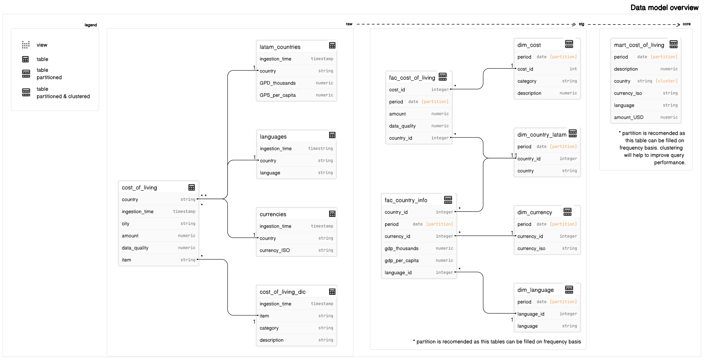
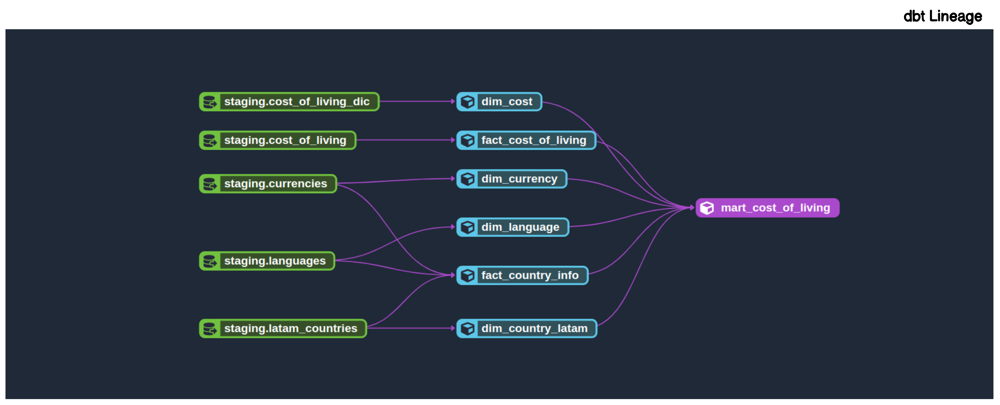
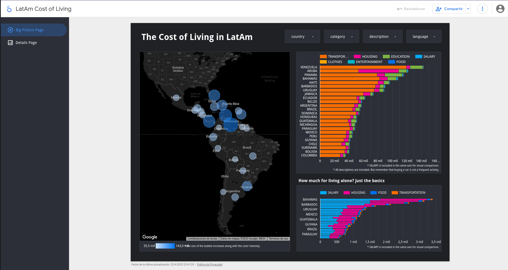
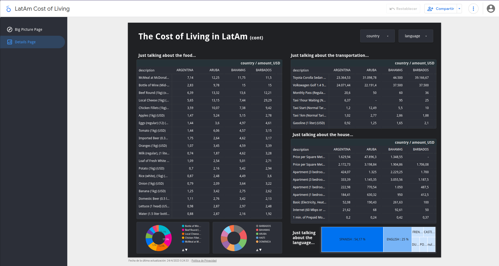

# LatAm CooLiving

## Problem description

So, the idea came up while I was having a BBQ with my family and friends. We were talking about migration in Latin America and debating which countries were the most expensive and the cheapest. Some of my friends and my dad were thinking about moving to places like Argentina or Uruguay, and I was like, "I'll help you guys out! I'll bring some more info to the next gathering so you can make better decisions!"

That's how I came up with the idea of doing a project to gather accurate information on the cost of living in different countries in Latin America. I hope I can help people make the best decisions for their lives!

In this project, I will be creating a dashboard (and the required pipelines and automation infrastructure) that displays data on the cost of essential items for daily life such as transportation, food, and household expenses. The main questions that I will be answering are:

1. What is the most expensive and cheapest country to live in, and why?
2. What is the most expensive and cheapest country if we consider only basic items for a single person living alone?
3. How does my current country of residence compare to the rest of Latin America? Am I living in the cheapest or most expensive country? This is crucial for my friends and my dad to decide whether or not they want to migrate.
4. Get a brief understanding of the current price dynamics in Latin America.

_All concepts (incomes and expenses) are considered in USD (United States dollar)._

## Acceptance criteria

I hope that the following diagram helps to understand the expected quality for the project.

_The complete criteria can be found [here](https://github.com/DataTalksClub/data-engineering-zoomcamp/tree/main/week_7_project)._

# Solution overview

## Architecture overview

The following architecture enables breaking down complex functionality into smaller, more manageable responsibility pipelines.

The used technologies include:

* __Data Origin__: Kaggle API and Internet public data
* __Cloud Storage__: Google Cloud Platform (GCP)
* __Infrastructure as Code__: Terraform
* __Workflow Orchestration__: Prefect
* __Data Warehouse__: Big Query (in GCP)
* __Visualization__: Looker Studio (by Google)

The future improvementes could include:

* Use a docker container in the cloud for excecuting the end-2-end pipeline.
* Use Prefect to orchestrate the dbt workflow.

## Data model overview

* __raw stage__: At this stage, the raw data is available in the datawarehouse. The data is stored in tables.
* __stg stage__: At this stage, the data is cleaned and builds a star model squema. The data is stored in partitioned and clustered tables.
* __core (mart) stage__: At this stage, the data is available and ready to be used by business analysts (in this case, just me to build the dashboard). The data is stored in partitioned and clustered tables.

The following diagram shows the dbt lineage for building every step in the data model.

## Visualization

The [dashboard](https://lookerstudio.google.com/reporting/d28a00b7-2442-4499-ba90-da250d1b38f2) have 2 pages that can be explored and used to answer the questions.

This page has four filter options: by country, category, description, and language.
This page has three visualizations: a map of the Latin American region that shows dots representing the cost of living in each country, with bigger dots indicating higher expenses; a stacked bar chart that shows all category expenses and incomes; and a stacked bar chart that shows a selection of categories and items that commonly account for day-to-day expenses and incomes.

This page has four filter options: by country and language.
This page has four visualizations: a heatmap matrix for detailed exploration, two donut charts to display the top five most expensive food items and countries, a heatmap matrix for detailed exploration of the transportation category, a heatmap matrix for detailed exploration of the housing category, and a tree map graph to summarize language data.

### Answers

1. What is the most expensive and cheapest country to live in, and why?

The most expensive: Venezuela. This is due to the high prices of some transportation items.

The cheapest: Colombia.

2. What is the most expensive and cheapest country if we consider only basic items for a single person living alone?

The most expensive: Bahamas.

The cheapest: Colombia.

3. How does my current country of residence compare to the rest of Latin America? Am I living in the cheapest or most expensive country? This is crucial for my friends and my dad to decide whether or not they want to migrate.

Cannot disclose my current country of residence, but my friends and dad have decided to reconsider their plans to move to another country.

4. Get a brief understanding of the current price dynamics in Latin America.

It was great to know that:

* Barbados has the most expensive Local Cheese (29.29 USD) !!!
* The 5 most expensive food items across LatAm are, in order: a bottle of wine, beef round, local cheese, chicken fillets, and a hamburguer meal.
* The 5 most expensive (Spanish talking) countries across LaTam are, in order and just talking about food: Uruguay, Panama, Mexico, Guatemala, and Colombia.
* Venezuela has the most expensive comparison car price.
* Colombia (among the Spanish talking countries) has the cheapest apartment rentals in the entire region.
* Paraguay (among the Spanish talking countries) has the cheapest internet service across LatAm.
* The Spanish language is spoken in 8 countries.

The future improvementes could include:

* To improve the analysis, it would be beneficial to explore additional data sources for better insights and comparisons. Accuracy is important when considering the five Vs of big data: volume, velocity, variety, veracity, and value.

# How to run and repository structure

Please follow the step by step guide [here](HowToRun.md).

# Author

Click on me!

Hans, the hedgehog.

# Final words

I created this project for the [Data Talks Club](https://datatalks.club/) as part of the capstone project for the [Data Engineering Zoomcamp](https://github.com/DataTalksClub/data-engineering-zoomcamp). I would like to give a big shoutout to the amazing community, especially [Alexey Grigorev](https://twitter.com/Al_Grigor) and all the instructors, for providing an awesome learning experience.
